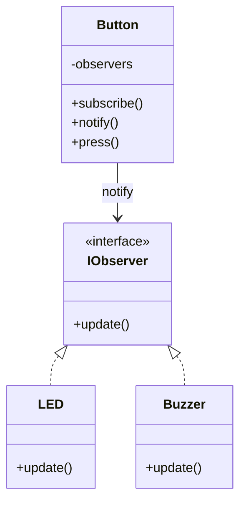

# ❌ BAD DESIGN

```cpp
class LED {
public:
    void on() { std::cout << "LED ON\n"; }
};

class Buzzer {
public:
    void beep() { std::cout << "Buzzer BEEP\n"; }
};

class Button {
    LED led;
    Buzzer buzzer;
public:
    void press() {
        led.on();      
        buzzer.beep(); 
    }
};
```




---


```cpp

#include <vector>
class IObserver {
public:
    virtual void update() = 0;
};

class LED : public IObserver {
public:
    void update() override {
        std::cout << "LED ON\n";
    }
};

class Buzzer : public IObserver {
public:
    void update() override {
        std::cout << "Buzzer BEEP\n";
    }
};


class Button {
    std::vector<IObserver*> observers;
public:
    void subscribe(IObserver* obs) {
        observers.push_back(obs);
    }

    void notify() {
        for (auto obs : observers)
            obs->update();
    }

    void press() {
        std::cout << "Button Pressed\n";
        notify(); 
    }
};
int main() {
    Button btn;

    LED led;
    Buzzer buzzer;

    btn.subscribe(&led);
    btn.subscribe(&buzzer);

    btn.press();
}
```

---

