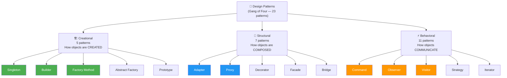
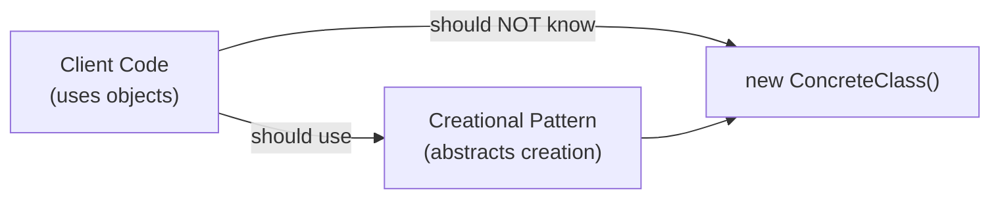
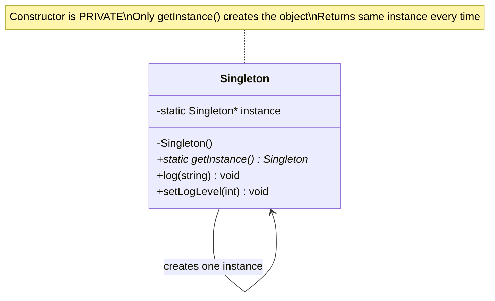
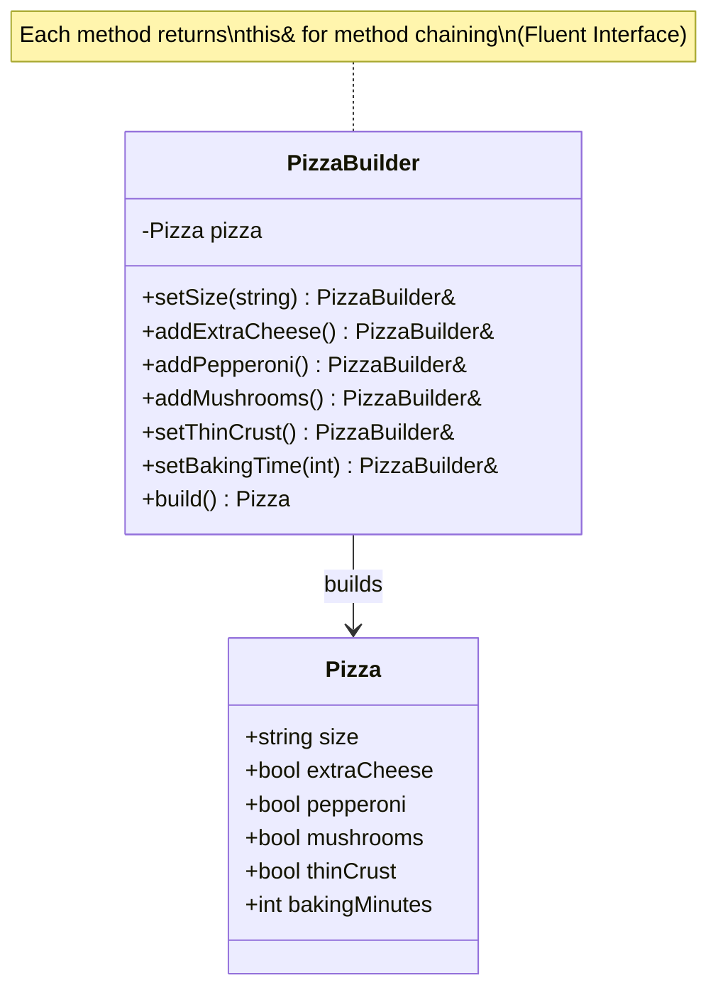
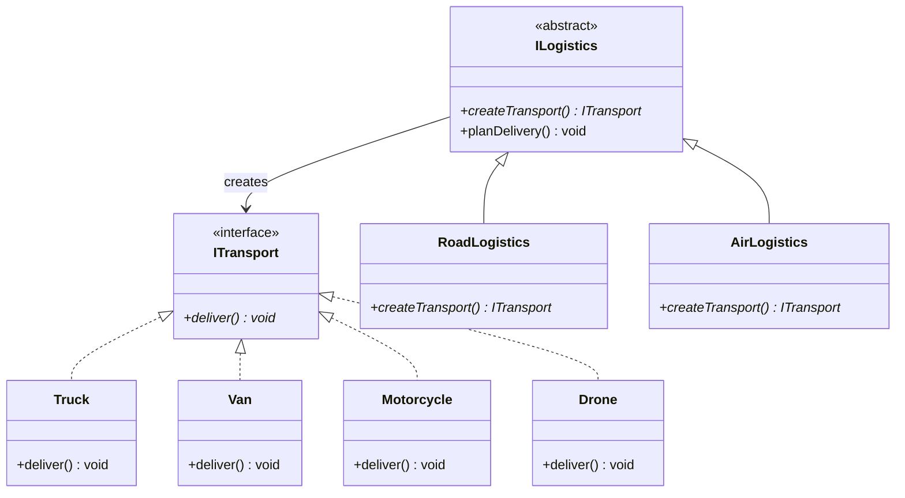
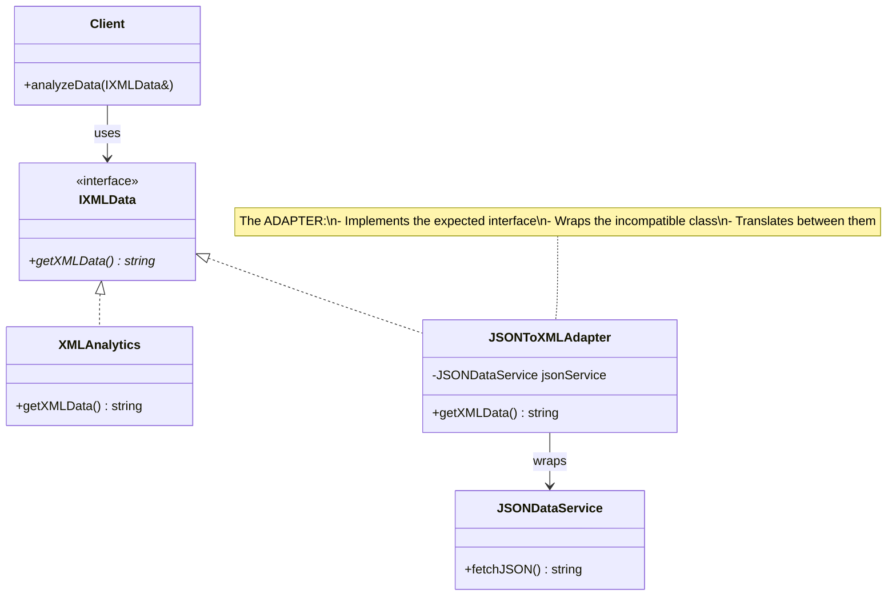
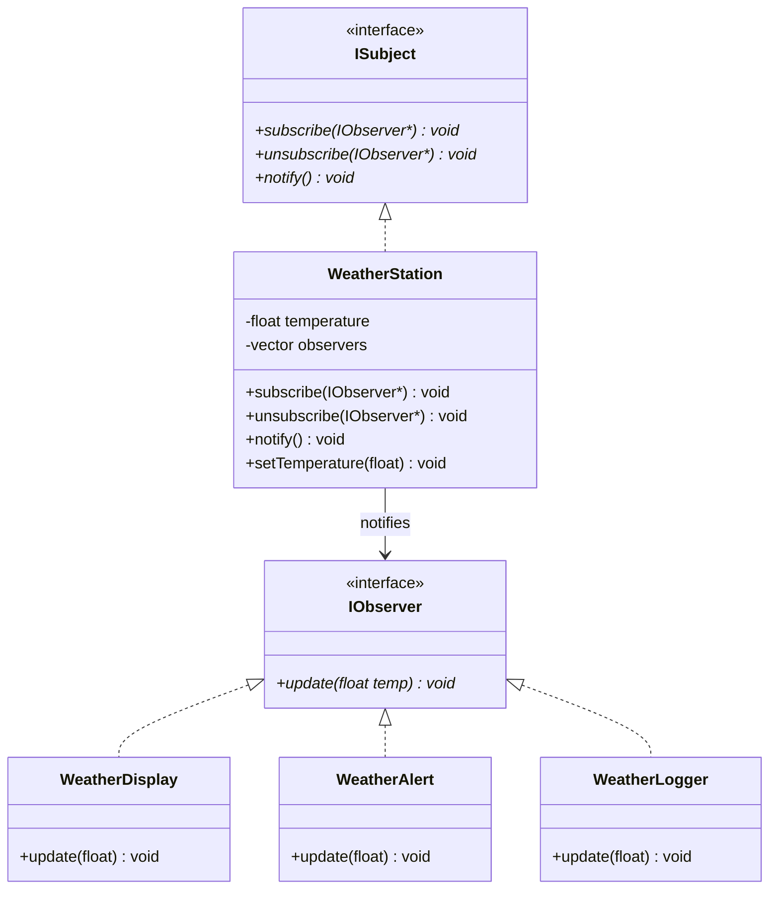

# 🎨 Design Patterns in C++ — Complete 5-Hour Lecture

**Course:** Software Engineering & Embedded Systems **Duration:** 5 Hours (300 minutes) **Level:** Intermediate to Advanced C++ **Author:** Mohamed Nabil

---

> [!info] Lecture Overview This lecture covers the fundamentals of Design Patterns in C++ across all three categories: Creational, Structural, and Behavioral. We study 8 carefully selected patterns with deep theory, real-world analogies, UML-style Mermaid diagrams, bad vs. good C++ examples, and step-by-step refactoring. By the end, students can recognize, implement, and choose the right pattern for any design problem.

---

## 📋 Table of Contents

1. [[#Part 1 — Introduction to Design Patterns]]
2. [[#Part 2 — Creational Patterns]] _
    - [[#Pattern 1 — Singleton]]
    - [[#Pattern 2 — Builder]]
    - [[#Pattern 3 — Factory Method]]
3. [[#Part 3 — Structural Patterns]]
    - [[#Pattern 4 — Adapter]]
4. [[#Part 4 — Behavioral Patterns]] 
    - [[#Pattern 5 — Observer]]
5. [[#Part 5 — Patterns Comparison & When to Use Each]]


---

# Part 1 — Introduction to Design Patterns

> [!note] Instructor Note Start with a story: _"Imagine two architects designing a building. One starts from scratch every time. The other uses proven blueprints adapted to the context. Who delivers better, faster, more reliable work?"_ This frames why patterns matter.

## 1.1 What is a Design Pattern?

A **Design Pattern** is a **general, reusable solution** to a commonly occurring problem in software design. It is not a finished piece of code — it is a **template** or **blueprint** that you adapt to your specific situation.

The concept was popularized by the **"Gang of Four" (GoF)** — Erich Gamma, Richard Helm, Ralph Johnson, and John Vlissides — in their landmark 1994 book:

> _"Design Patterns: Elements of Reusable Object-Oriented Software"_

> [!important] Key Insight A Design Pattern is a **proven answer** to a question that has been asked thousands of times across thousands of projects. Instead of reinventing the wheel, you apply a tested solution and focus your creativity on the actual problem.

## 1.2 Why Do We Need Design Patterns?

Without patterns, developers tend to:

- Re-solve the same problems from scratch every time
- Create solutions that are hard to extend or maintain
- Build systems that are tightly coupled and untestable
- Use inconsistent approaches that confuse teammates

With patterns, you gain:

- **A shared vocabulary** — say "use a Singleton here" and every experienced developer knows exactly what that means
- **Proven solutions** — battle-tested approaches from decades of real-world experience
- **Better communication** — patterns are architectural language
- **Cleaner, more maintainable code** — patterns enforce separation of concerns

## 1.3 The Three Categories



## 1.4 Pattern Template (How We Study Each Pattern)

For every pattern, we follow the same structure:

|Section|What It Covers|
|---|---|
|**Intent**|What problem does this pattern solve?|
|**Motivation**|Why does the problem exist?|
|**Real-World Analogy**|A story from everyday life|
|**Structure (Mermaid)**|Class diagram showing relationships|
|**Bad Code ❌**|Code that shows the problem|
|**Good Code ✅**|Clean implementation of the pattern|
|**When to Use**|Practical guidelines|
|**Common Mistakes**|Pitfalls to avoid|
|**Student Exercise**|Practice problem|

## 1.5 Patterns vs. Algorithms

> [!warning] Important Distinction **Algorithms** solve computational problems (sorting, searching). **Design Patterns** solve architectural/structural problems (how to organize code). An algorithm tells you _what steps to follow_. A pattern tells you _how to structure your classes and their relationships_.

---

# Part 2 — Creational Patterns

> [!tip] Time Allocation: ~60 minutes

> [!note] Instructor Note Creational patterns answer one question: **"How should we create objects?"** The naive answer is `new MyClass()`. But this creates tight coupling to a specific class. Creational patterns give us flexibility in how, when, and what objects get created.

## What Are Creational Patterns?

Creational patterns **abstract the instantiation process**. They help make a system independent of how its objects are created, composed, and represented.

The core idea: **separate the code that uses objects from the code that creates them.**



---

# Pattern 1 — Singleton

## Intent

**Ensure a class has only one instance** and provide a **global point of access** to it.

## Motivation

Some resources in a system must exist exactly once:

- A configuration manager (you don't want two different configs active at the same time)
- A connection pool (one pool shared by all)
- A logger (all messages go to one place)
- A hardware driver (one driver per device)

If any code can create multiple instances of these, you get inconsistent state, resource waste, or outright bugs.

## Real-World Analogy

Think of a **country's president**. There is exactly one president at any given time. Anyone who wants to talk to the president goes through the same office. You don't create a new president every time you need one — you access the existing one through a well-known channel.

Or think of a **printer spool** in an office. All print jobs go to the same spool. If every application created its own spool, print jobs would collide.

## Bad Design Example ❌

```cpp
// ❌ BAD: Multiple instances can be created — no protection
#include <iostream>
#include <string>

class Logger {
    std::string logFile_;
public:
    Logger(const std::string& file) : logFile_(file) {}

    void log(const std::string& msg) {
        std::cout << "[" << logFile_ << "] " << msg << "\n";
    }
};

int main() {
    // Nothing stops creating multiple loggers pointing to different files!
    Logger logger1("app.log");
    Logger logger2("debug.log");   // ← second instance!
    Logger logger3("errors.log");  // ← third instance!

    // Which one is authoritative? All three exist simultaneously.
    // Different parts of the app write to different files.
    logger1.log("User logged in");
    logger2.log("User logged in");  // duplicate!
    logger3.log("User logged in");  // triplicate!

    return 0;
}
```

**Why it's wrong:**

- Multiple instances create inconsistent state
- No single source of truth for logs
- Wasted resources (multiple file handles)
- Different modules see different loggers

## Structure



## Good C++ Implementation ✅

```cpp
#include <iostream>
#include <string>
#include <mutex>
#include <fstream>

// ✅ GOOD: Thread-safe Singleton Logger using C++11 magic statics
class Logger {
public:
    // The one and only access point
    // C++11 guarantees this is thread-safe (magic static)
    static Logger& getInstance() {
        static Logger instance; // Created once, destroyed at program exit
        return instance;
    }

    // Delete copy constructor and assignment operator
    // This PREVENTS accidental copying
  

    void log(const std::string& msg) {
        std::lock_guard<std::mutex> lock(mutex_);
        std::cout << "[LOG] " << msg << "\n";
        // In real code: write to file
    }

    void setLogLevel(int level) {
        std::lock_guard<std::mutex> lock(mutex_);
        logLevel_ = level;
    }

    int getLogLevel() const { return logLevel_; }

private:
    // Private constructor — no one outside can call new Logger()
    Logger() : logLevel_(1) {
        std::cout << "Logger initialized (only once!)\n";
    }
  Logger(const Logger&)            = delete;
    Logger& operator=(const Logger&) = delete;
    int         logLevel_;
    std::mutex  mutex_;
};

// Usage
int main() {
    // Both references point to THE SAME object
    Logger& log1 = Logger::getInstance();
    Logger& log2 = Logger::getInstance();

    std::cout << "Same instance? "
              << (&log1 == &log2 ? "YES ✅" : "NO ❌") << "\n";

    log1.log("Application started");
    log2.log("User logged in");       // Same logger, same file
    log1.setLogLevel(2);
    std::cout << "Log level: " << log2.getLogLevel() << "\n"; // 2 — same object

    return 0;
}
```

## Step-by-Step Refactoring

**Step 1:** Make the constructor `private` — no one can call `new Logger()` from outside.

**Step 2:** Add a `static getInstance()` method — this is the single access point.

**Step 3:** Inside `getInstance()`, use a `static` local variable — C++11 guarantees it's initialized exactly once, even in multithreaded scenarios.

**Step 4:** Delete the copy constructor and copy assignment operator — prevents `Logger copy = Logger::getInstance()` from creating a second instance.

## When to Use Singleton

✅ When exactly one instance of a class must exist (hardware drivers, config, connection pool) ✅ When global access is needed but a global variable would be dangerous ✅ When lazy initialization is important (don't create until first used)

❌ Do NOT use when the class doesn't truly need a single instance ❌ Do NOT use to avoid passing objects around (this is a design smell) ❌ Do NOT use when testability is critical (Singletons are hard to mock)

## Common Mistakes

> [!warning] Common Singleton Mistakes
> 
> - **Not deleting copy constructor/operator** — allows creating copies, defeating the purpose
> - **Non-thread-safe implementation** — using a raw pointer with `if (!instance)` check without a mutex in C++03 style
> - **Overusing Singleton** — it becomes global state, which makes testing very hard. Always ask: "Do I truly need exactly one instance?"
> - **Destroying and recreating** — if the Singleton manages a resource (file, socket), ensure proper cleanup in the destructor

## Student Exercise

> [!example] Exercise — Singleton Implement a `ConfigManager` Singleton that:
> 
> - Stores key-value configuration pairs (`std::map<std::string, std::string>`)
> - Has `set(key, value)` and `get(key)` methods
> - Returns a default value if the key doesn't exist
> - Is thread-safe
> 
> **Test:** Verify that two calls to `ConfigManager::getInstance()` return the same object.

---

# Pattern 2 — Builder

## Intent

**Separate the construction of a complex object from its representation**, allowing the same construction process to create different representations.

## Motivation

Some objects require many steps to construct, or have many optional parameters. Consider building a `House` — you need walls, a roof, windows, maybe a garage, maybe a pool. If you put all this in a constructor, you get:

```cpp
House h(true, false, 2, 4, true, false, "brick", "tile", 3, true...);
// What do all these booleans mean? Disaster!
```

The **Builder** pattern lets you construct the object step by step, with a clear, readable API.

## Real-World Analogy

Think of ordering a **custom sandwich** at a deli. You tell the server step by step:

- "Give me a footlong"
- "Add turkey"
- "Add Swiss cheese"
- "No onions"
- "Add mustard"
- "Toast it please"

You don't hand over a form with 20 fields — you build it piece by piece. The server (Builder) accumulates your choices and hands you the finished sandwich at the end.

Compare this to a **fast food combo** (a fixed, pre-configured object) — that's a different pattern (Factory). Builder is for complex, custom construction.

## Bad Design Example ❌

```cpp
// ❌ BAD: Constructor with too many parameters — unreadable and error-prone

class Pizza {
public:
    // Which bool is which? Easy to swap arguments accidentally!
    Pizza(std::string size, bool extraCheese, bool pepperoni,
          bool mushrooms, bool olives, bool thinCrust,
          int bakingTemp, int bakingMinutes) {
        // ...
    }
};

int main() {
    // What does this mean? Is thin crust on or off?
    // Did I accidentally swap bakingTemp and bakingMinutes?
    Pizza p("large", true, false, true, false, true, 220, 15);
    // Completely unreadable! ❌
    return 0;
}
```

## Structure



## Good C++ Implementation ✅

```cpp
#include <iostream>
#include <string>
#include <vector>

// The product we're building
class Pizza {
public:
    std::string           size;
    bool                  extraCheese  = false;
    bool                  pepperoni    = false;
    bool                  mushrooms    = false;
    bool                  thinCrust    = false;
    int                   bakingMinutes = 12;
    std::vector<std::string> extras;

    void describe() const {
        std::cout << "=== Pizza Order ===\n"
                  << "Size:          " << size << "\n"
                  << "Extra Cheese:  " << (extraCheese ? "Yes" : "No") << "\n"
                  << "Pepperoni:     " << (pepperoni   ? "Yes" : "No") << "\n"
                  << "Mushrooms:     " << (mushrooms   ? "Yes" : "No") << "\n"
                  << "Thin Crust:    " << (thinCrust   ? "Yes" : "No") << "\n"
                  << "Baking Time:   " << bakingMinutes << " minutes\n";
        for (auto& e : extras) std::cout << "Extra:         " << e << "\n";
        std::cout << "==================\n";
    }
};

// The Builder — constructs Pizza step by step
class PizzaBuilder {
    Pizza pizza_;
public:
    // Each method returns *this to enable method chaining (Fluent Interface)
    PizzaBuilder& setSize(const std::string& size) {
        pizza_.size = size;
        return *this;
    }
    PizzaBuilder& addExtraCheese() {
        pizza_.extraCheese = true;
        return *this;
    }
    PizzaBuilder& addPepperoni() {
        pizza_.pepperoni = true;
        return *this;
    }
    PizzaBuilder& addMushrooms() {
        pizza_.mushrooms = true;
        return *this;
    }
    PizzaBuilder& setThinCrust() {
        pizza_.thinCrust = true;
        return *this;
    }
    PizzaBuilder& setBakingTime(int minutes) {
        pizza_.bakingMinutes = minutes;
        return *this;
    }
    PizzaBuilder& addExtra(const std::string& item) {
        pizza_.extras.push_back(item);
        return *this;
    }

    // Final step — returns the fully constructed product
    Pizza build() {
        if (pizza_.size.empty()) {
            throw std::logic_error("Pizza must have a size!");
        }
        return pizza_;
    }
};

int main() {
    // Readable, self-documenting, hard to make mistakes ✅
    Pizza myPizza = PizzaBuilder()
        .setSize("Large")
        .addExtraCheese()
        .addPepperoni()
        .setThinCrust()
        .setBakingTime(15)
        .addExtra("Jalapeños")
        .build();

    myPizza.describe();

    // A completely different pizza — same builder, different configuration
    Pizza simplePizza = PizzaBuilder()
        .setSize("Small")
        .addMushrooms()
        .build();

    simplePizza.describe();

    return 0;
}
```

## Step-by-Step Refactoring

**Step 1:** Identify the "complex object" — the one with many optional configurations. That's your **Product** (`Pizza`).

**Step 2:** Create a **Builder** class with the same fields as the Product.

**Step 3:** Replace constructor parameters with **setter methods** on the Builder. Each setter returns `*this` to enable chaining.

**Step 4:** Add a `build()` method that validates and returns the final Product.

**Step 5:** Client code becomes a readable, declarative chain of method calls.

## When to Use Builder

✅ When constructors have many parameters (4+ parameters is a code smell) ✅ When many parameters are optional ✅ When you want to construct different "variants" of the same object ✅ When object construction involves validation logic

❌ Do NOT use for simple objects with 1-2 parameters

## Common Mistakes

> [!warning] Common Builder Mistakes
> 
> - **Forgetting to return `*this`** — breaks the fluent interface, forcing clients to write one call per line
> - **Skipping validation in `build()`** — you can catch invalid configurations before the object is created
> - **Making the Product's fields public** — it's fine for the Builder-Product pair, but consider if wider code should modify it after construction

## Exercise

> [!example] Exercise — Builder Build a `ComputerBuilder` for a `Computer` object with:
> 
> - CPU (required): "Intel i5", "Intel i9", "AMD Ryzen"
> - RAM (required): 8, 16, 32 GB
> - Storage (optional): SSD or HDD, size
> - GPU (optional): model name
> - WiFi (optional): bool
> 
> **Test:** Build a gaming PC and an office PC using the same builder.

---

# Pattern 3 — Factory Method

## Intent

**Define an interface for creating an object, but let subclasses decide which class to instantiate.** Factory Method lets a class defer instantiation to subclasses.

## Motivation

When your code needs to create objects but shouldn't be tied to a specific class, you need a factory. The Factory Method pattern says: _"Don't call `new` directly. Call a method that decides what to create."_

This is the OCP applied to object creation: you can add new product types without modifying existing creator code.

## Real-World Analogy

Think of a **logistics company**. When you request a delivery, you call the company's booking system. Internally, they decide whether to send a truck, a van, a motorcycle, or a drone — depending on the package size, distance, and availability. You don't choose the vehicle — the factory (booking system) does. You just request a delivery.

## Bad Design Example ❌

```cpp
// ❌ BAD: Client code directly decides which object to create
// Adding a new vehicle type requires modifying THIS code — OCP violation!

#include <iostream>
#include <string>

class Truck {
public:
    void deliver() { std::cout << "Delivering by Truck 🚚\n"; }
};

class Van {
public:
    void deliver() { std::cout << "Delivering by Van 🚐\n"; }
};

class Motorcycle {
public:
    void deliver() { std::cout << "Delivering by Motorcycle 🏍️\n"; }
};

void planDelivery(const std::string& type) {
    // Every new vehicle = modify this function
    if (type == "truck") {
        Truck t;
        t.deliver();
    } else if (type == "van") {
        Van v;
        v.deliver();
    } else if (type == "motorcycle") {
        Motorcycle m;
        m.deliver();
    }
    // Adding "drone"? Must modify this function ❌
}

int main() {
    planDelivery("truck");
    planDelivery("motorcycle");
    return 0;
}
```

## Structure



## Good C++ Implementation ✅

```cpp
#include <iostream>
#include <memory>
#include <string>

// ── Product Interface ──────────────────────────────────────
class ITransport {
public:
    virtual void deliver() = 0;
    virtual ~ITransport()  = default;
};

// ── Concrete Products ──────────────────────────────────────
class Truck : public ITransport {
public:
    void deliver() override {
        std::cout << "📦 Delivering by Truck — large cargo on highways\n";
    }
};

class Van : public ITransport {
public:
    void deliver() override {
        std::cout << "📦 Delivering by Van — medium cargo, city routes\n";
    }
};

class Motorcycle : public ITransport {
public:
    void deliver() override {
        std::cout << "📦 Delivering by Motorcycle — small parcels, fast\n";
    }
};

// NEW: Add drone WITHOUT changing any existing code ✅ (OCP)
class Drone : public ITransport {
public:
    void deliver() override {
        std::cout << "📦 Delivering by Drone — remote areas, overnight\n";
    }
};

// ── Creator (Abstract) ─────────────────────────────────────
class Logistics {
public:
    // The Factory Method — subclasses decide what to create
    virtual std::unique_ptr<ITransport> createTransport() = 0;
    virtual ~Logistics() = default;

    // Template method that uses the factory method
    // This code never changes, even when new transports are added
    void planDelivery() {
        auto transport = createTransport(); // polymorphic creation
        std::cout << "Planning route...\n";
        transport->deliver();
        std::cout << "Delivery complete!\n\n";
    }
};

// ── Concrete Creators ──────────────────────────────────────
class RoadLogistics : public Logistics {
public:
    std::unique_ptr<ITransport> createTransport() override {
        return std::make_unique<Truck>();
    }
};

class CityLogistics : public Logistics {
public:
    std::unique_ptr<ITransport> createTransport() override {
        return std::make_unique<Motorcycle>();
    }
};

// Adding new logistics type — NO existing code changes ✅
class AirLogistics : public Logistics {
public:
    std::unique_ptr<ITransport> createTransport() override {
        return std::make_unique<Drone>();
    }
};

int main() {
    // Each logistics type creates the right vehicle automatically
    RoadLogistics road;
    road.planDelivery();

    CityLogistics city;
    city.planDelivery();

    AirLogistics air;
    air.planDelivery();

    return 0;
}
```

## Step-by-Step Refactoring

**Step 1:** Identify the `new ConcreteClass()` calls scattered in client code. These are the problem.

**Step 2:** Define a **Product interface** (`ITransport`) that all concrete products implement.

**Step 3:** Define a **Creator abstract class** (`Logistics`) with a pure virtual `createTransport()` method — the Factory Method.

**Step 4:** Create **Concrete Creators** (`RoadLogistics`, `AirLogistics`) each overriding `createTransport()` to return the appropriate product.

**Step 5:** Client code works with `Logistics*` — it never calls `new` on a specific product class.

## When to Use Factory Method

✅ When you don't know ahead of time what class to instantiate ✅ When you want subclasses to control what gets created ✅ When you want to add new product types without changing existing code (OCP) ✅ When object creation is complex and should be encapsulated

## Common Mistakes

> [!warning] Common Factory Method Mistakes
> 
> - **Confusing Factory Method with Simple Factory** — a Simple Factory is just a class with a `create()` method and a big `if/else`. Factory Method uses polymorphism.
> - **Putting too much logic in the factory** — the factory creates. It doesn't configure, orchestrate, or execute business logic.
> - **Returning raw pointers** — always use `unique_ptr` or `shared_ptr` in modern C++

## Student Exercise

> [!example] Exercise — Factory Method Implement a `DocumentFactory` system that creates different document types:
> 
> - `PDFDocument` — has `render()` that prints "Rendering PDF"
> - `WordDocument` — has `render()` that prints "Rendering Word Doc"
> - `HTMLDocument` — has `render()` that prints "Rendering HTML"
> 
> Create a `DocumentCreator` abstract class with a `createDocument()` factory method. Test: Add a new `MarkdownDocument` without modifying any existing class.

---

# Part 3 — Structural Patterns
> [!note] Instructor Note Structural patterns answer: **"How do we compose objects and classes into larger structures?"** Think of building with LEGO — structural patterns are about how pieces connect and fit together, even when they weren't originally designed to.

## What Are Structural Patterns?

Structural patterns deal with **object composition** — creating relationships between objects to form larger, more complex structures. They help ensure that when one part changes, the whole structure doesn't have to be redesigned.

Key themes:

- Making incompatible interfaces work together (Adapter)
- Controlling access to objects (Proxy)
- Adding responsibilities dynamically (Decorator)
- Simplifying complex subsystems (Facade)

---

# Pattern 4 — Adapter

## Intent

**Convert the interface of a class into another interface that clients expect.** Adapter lets classes work together that couldn't otherwise because of incompatible interfaces.

## Motivation

You have a system that works with a specific interface. You want to use a third-party library, a legacy class, or an external service — but its interface is different. You can't change either one (they're both fixed). The Adapter sits in between and translates.

## Real-World Analogy

Think of a **power adapter** when you travel internationally. Your laptop has a US plug (Type A). The European outlet is Type C. You can't change your laptop's power brick, and you can't change the wall. The adapter sits in between and makes them work together — it **adapts** one interface to another.

Another analogy: a **language interpreter** at a UN meeting. The French speaker speaks French, the Japanese delegate speaks Japanese. The interpreter adapts one language to another in real time without either speaker needing to change.

## Bad Design Example ❌

```cpp
// ❌ BAD: Client is tightly coupled to a specific XML interface
//        Now we want to use a JSON library, but can't because interfaces differ

#include <iostream>
#include <string>

// What our system expects — XML interface
class IXMLData {
public:
    virtual std::string getXMLData() = 0;
    virtual ~IXMLData() = default;
};

class XMLAnalytics : public IXMLData {
public:
    std::string getXMLData() override {
        return "<data><value>42</value></data>";
    }
};

// Our client is hardcoded to use IXMLData
void analyzeData(IXMLData& source) {
    std::cout << "Processing: " << source.getXMLData() << "\n";
}

// NEW external JSON library — we CANNOT modify this class
class JSONDataService {
public:
    std::string fetchJSON() {  // Different method name!
        return "{\"value\": 42}";
    }
};

int main() {
    XMLAnalytics xml;
    analyzeData(xml); // Works fine

    JSONDataService json;
    // analyzeData(json); // ← COMPILE ERROR! JSONDataService is not IXMLData
    // We're stuck — can't use the JSON library ❌
    return 0;
}
```

## Structure



## Good C++ Implementation ✅

```cpp
#include <iostream>
#include <string>
#include <memory>

// ── Target Interface (what our system expects) ─────────────
class IDataSource {
public:
    virtual std::string getData() = 0;
    virtual ~IDataSource() = default;
};

// ── Existing compatible class ──────────────────────────────
class XMLDataSource : public IDataSource {
public:
    std::string getData() override {
        return "<data><value>42</value></data>";
    }
};

// ── Incompatible class (Adaptee) — cannot be modified ──────
// This could be a third-party library, legacy code, external API
class JSONDataService {
public:
    std::string fetchJSON() {
        return R"({"value": 42, "status": "ok"})";
    }
    std::string getMetadata() {
        return R"({"source": "api", "version": "2.0"})";
    }
};

// ── The Adapter ────────────────────────────────────────────
// Implements the expected interface (IDataSource)
// Wraps the incompatible class (JSONDataService)
// Translates between them
class JSONAdapter : public IDataSource {
    JSONDataService adaptee_; // wrapping the incompatible class
public:
    std::string getData() override {
        // Translate: call the adaptee's method, convert the result
        std::string json = adaptee_.fetchJSON();
        // In reality, parse JSON and convert to XML (simplified here)
        return "<data>" + json + "</data>"; // adapted output
    }
};

// ── External REST API Adapter ──────────────────────────────
class RestAPIClient {
public:
    std::string callEndpoint(const std::string& url) {
        return "REST response from: " + url;
    }
};

class RestAPIAdapter : public IDataSource {
    RestAPIClient client_;
    std::string   endpoint_;
public:
    explicit RestAPIAdapter(const std::string& url) : endpoint_(url) {}
    std::string getData() override {
        return client_.callEndpoint(endpoint_);
    }
};

// ── Client — only knows about IDataSource ─────────────────
class DataAnalyzer {
public:
    void analyze(IDataSource& source) {
        std::string data = source.getData();
        std::cout << "Analyzing: " << data << "\n";
    }
};

int main() {
    DataAnalyzer analyzer;

    // Original XML source
    XMLDataSource xmlSource;
    analyzer.analyze(xmlSource);

    // JSON service via Adapter — no changes to DataAnalyzer! ✅
    JSONAdapter jsonAdapter;
    analyzer.analyze(jsonAdapter);

    // REST API via Adapter — still no changes to DataAnalyzer! ✅
    RestAPIAdapter restAdapter("https://api.example.com/data");
    analyzer.analyze(restAdapter);

    return 0;
}
```

## Step-by-Step Refactoring

**Step 1:** Identify the **Target interface** — what your client code expects (`IDataSource`).

**Step 2:** Identify the **Adaptee** — the incompatible class you want to use (`JSONDataService`).

**Step 3:** Create an **Adapter** class that:

- **Inherits from** (or implements) the Target interface
- **Contains** (wraps) the Adaptee
- **Translates** calls from the Target interface to the Adaptee's API

**Step 4:** Client code uses the Adapter through the Target interface — no knowledge of the Adaptee.

## When to Use Adapter

✅ When you want to use an existing class but its interface doesn't match what you need ✅ When integrating third-party libraries into your system ✅ When working with legacy code that can't be changed ✅ When you want to create a reusable class that cooperates with unrelated classes

## Common Mistakes

> [!warning] Common Adapter Mistakes
> 
> - **Adapting too much** — the Adapter should only translate interfaces, not add business logic
> - **Confusing Adapter with Facade** — Adapter makes incompatible interfaces compatible. Facade simplifies a complex subsystem. Different problems.
> - **Using inheritance instead of composition** — prefer wrapping the Adaptee as a member, not inheriting from it (avoids exposing Adaptee's full interface)

## Exercise

> [!example] Exercise — Adapter You have an `ILogger` interface with `log(string)`. You want to use an existing `FileWriter` class that has `writeToFile(string, string)` (filename, content). Write an Adapter that makes `FileWriter` usable as an `ILogger`.

---

# Part 4 — Behavioral Patterns

> [!tip] Time Allocation: ~90 minutes

> [!note] Instructor Note Behavioral patterns are the richest category. They answer: **"How do objects communicate and distribute responsibility?"** The key insight: objects should collaborate without being tightly coupled. They should be able to vary how they interact independently of each other.

## What Are Behavioral Patterns?

Behavioral patterns are concerned with **algorithms and the assignment of responsibilities between objects**. They describe not just patterns of objects or classes but also the patterns of communication between them.

Key themes:

- Encapsulating actions as objects (Command)
- Notifying interested parties about changes (Observer)
- Separating operations from the objects they operate on (Visitor)

---


---

# Pattern 5 — Observer

## Intent

**Define a one-to-many dependency between objects** so that when one object (Subject) changes state, all its dependents (Observers) are notified and updated automatically.

## Motivation

Sometimes many parts of a system need to react to a change in one object. The naive solution: the changed object calls each dependent directly. Problems: tight coupling (the Subject must know all its dependents), can't add new dependents without modifying the Subject, and the Subject shouldn't know about UI or network code.

Observer says: dependents _subscribe_ to the Subject. When the Subject changes, it _notifies all subscribers_. The Subject never knows who subscribed — it just broadcasts.

## Real-World Analogy

Think of a **YouTube channel**. The channel owner (Subject) posts a new video. All subscribers (Observers) get notified. The channel owner doesn't call each subscriber personally — they just post, and YouTube's notification system (the Observer mechanism) does the rest.

Key points:

- Subscribers can subscribe/unsubscribe at any time
- The channel doesn't know who its subscribers are
- Different subscribers react differently (email notification, push notification, SMS)

Another analogy: a **newspaper subscription**. The newspaper (Subject) is printed. All subscribers receive a copy. The newspaper doesn't know what each subscriber will do with it.

## Bad Design Example ❌

```cpp
// ❌ BAD: WeatherStation directly calls all consumers
// Adding a new consumer = modifying WeatherStation

#include <iostream>

class WeatherDisplay {
public:
    void update(float temp) {
        std::cout << "Display: Temperature is " << temp << "°C\n";
    }
};

class WeatherAlert {
public:
    void update(float temp) {
        if (temp > 35) std::cout << "ALERT: Extreme heat warning!\n";
    }
};

class WeatherStation {
    float temperature_ = 0;
    WeatherDisplay display_; // ← direct coupling!
    WeatherAlert   alert_;   // ← direct coupling!
public:
    void setTemperature(float temp) {
        temperature_ = temp;
        display_.update(temp); // ← hardcoded call
        alert_.update(temp);   // ← hardcoded call
        // Adding a new observer (e.g., WeatherLogger)?
        // Must modify WeatherStation ❌
    }
};
```

## Structure



## Good C++ Implementation ✅

```cpp
#include <iostream>
#include <vector>
#include <algorithm>
#include <string>
#include <fstream>

// ── Observer Interface ─────────────────────────────────────
class IWeatherObserver {
public:
    virtual void onWeatherUpdate(float temperature,
                                  float humidity,
                                  float pressure) = 0;
    virtual ~IWeatherObserver() = default;
};

// ── Subject Interface ──────────────────────────────────────
class IWeatherSubject {
public:
    virtual void subscribe(IWeatherObserver* observer)   = 0;
    virtual void unsubscribe(IWeatherObserver* observer) = 0;
    virtual void notifyObservers()                       = 0;
    virtual ~IWeatherSubject() = default;
};

// ── Concrete Subject ───────────────────────────────────────
class WeatherStation : public IWeatherSubject {
    std::vector<IWeatherObserver*> observers_;
    float temperature_ = 0;
    float humidity_    = 0;
    float pressure_    = 0;
public:
    void subscribe(IWeatherObserver* obs) override {
        observers_.push_back(obs);
        std::cout << "✅ Observer subscribed. Total: " << observers_.size() << "\n";
    }
    void unsubscribe(IWeatherObserver* obs) override {
        observers_.erase(std::remove(observers_.begin(), observers_.end(), obs),
                         observers_.end());
        std::cout << "❌ Observer unsubscribed. Total: " << observers_.size() << "\n";
    }
    void notifyObservers() override {
        for (auto* obs : observers_) {
            obs->onWeatherUpdate(temperature_, humidity_, pressure_);
        }
    }
    void setMeasurements(float temp, float humidity, float pressure) {
        temperature_ = temp;
        humidity_    = humidity;
        pressure_    = pressure;
        std::cout << "\n🌡️  Weather station updated: "
                  << temp << "°C, " << humidity << "%, " << pressure << "hPa\n";
        notifyObservers(); // broadcast to all subscribers
    }
};

// ── Concrete Observers ─────────────────────────────────────
class DisplayObserver : public IWeatherObserver {
    std::string name_;
public:
    explicit DisplayObserver(const std::string& name) : name_(name) {}
    void onWeatherUpdate(float temp, float humidity, float pressure) override {
        std::cout << "[" << name_ << "] Temp: " << temp
                  << "°C | Humidity: " << humidity
                  << "% | Pressure: " << pressure << "hPa\n";
    }
};

class AlertObserver : public IWeatherObserver {
public:
    void onWeatherUpdate(float temp, float humidity, float /*pressure*/) override {
        if (temp > 35)       std::cout << "🔥 ALERT: Extreme heat! " << temp << "°C\n";
        if (humidity > 90)   std::cout << "💧 ALERT: Very high humidity! " << humidity << "%\n";
        if (temp < 0)        std::cout << "🧊 ALERT: Freezing temperature! " << temp << "°C\n";
    }
};

class StatisticsObserver : public IWeatherObserver {
    float sumTemp_  = 0;
    int   count_    = 0;
    float maxTemp_  = -999;
    float minTemp_  =  999;
public:
    void onWeatherUpdate(float temp, float /*h*/, float /*p*/) override {
        sumTemp_ += temp;
        ++count_;
        maxTemp_ = std::max(maxTemp_, temp);
        minTemp_ = std::min(minTemp_, temp);
        std::cout << "[Stats] Avg: " << (sumTemp_/count_)
                  << "°C | Max: " << maxTemp_
                  << "°C | Min: " << minTemp_ << "°C\n";
    }
};

// Adding a new observer — NO changes to WeatherStation ✅ (OCP)
class LoggerObserver : public IWeatherObserver {
public:
    void onWeatherUpdate(float temp, float humidity, float pressure) override {
        std::cout << "[Logger] Recording: " << temp << "°C, "
                  << humidity << "%, " << pressure << "hPa\n";
    }
};

int main() {
    WeatherStation station;

    DisplayObserver   mainDisplay("Main Display");
    DisplayObserver   phoneDisplay("Phone App");
    AlertObserver     alertSystem;
    StatisticsObserver stats;
    LoggerObserver    logger;

    station.subscribe(&mainDisplay);
    station.subscribe(&phoneDisplay);
    station.subscribe(&alertSystem);
    station.subscribe(&stats);
    station.subscribe(&logger);

    station.setMeasurements(22.5f, 65.0f, 1013.0f);
    station.setMeasurements(36.8f, 92.0f, 1008.0f); // triggers alerts!

    std::cout << "\n=== Phone app unsubscribed ===\n";
    station.unsubscribe(&phoneDisplay);
    station.setMeasurements(18.0f, 55.0f, 1020.0f);

    return 0;
}
```

## When to Use Observer

✅ When changes to one object require changing others, and you don't know how many objects need to change ✅ When an object should be able to notify other objects without assumptions about who those objects are ✅ Event-driven systems: GUI events, message queues, pub/sub systems ✅ When loose coupling between related objects is desired

## Common Mistakes

> [!warning] Common Observer Mistakes
> 
> - **Dangling pointers** — if an Observer is destroyed without unsubscribing, the Subject holds a dead pointer. Always unsubscribe in the Observer's destructor.
> - **Update cascade** — if an Observer's `update()` triggers another notification, you can get infinite loops
> - **Too many notifications** — if the Subject changes frequently, batch updates rather than notifying on every single change
> - **Thread safety** — if Subjects and Observers live on different threads, synchronize access to the observer list

## Student Exercise

> [!example] Exercise — Observer Implement a `StockMarket` Subject that tracks stock prices. Implement three Observers:
> 
> - `PortfolioTracker` — prints portfolio value when a stock changes
> - `PriceAlert` — triggers an alert when a stock rises/falls more than 10%
> - `TradingBot` — automatically "buys" when price drops 5%
> 
> Test: subscribe all three, change prices, then unsubscribe one and change again.

---


> [!quote] Final Thought _"Each pattern describes a problem which occurs over and over again in our environment, and then describes the core of the solution to that problem, in such a way that you can use this solution a million times over, without ever doing it the same way twice."_ — Christopher Alexander (quoted in GoF)
> 
> Design Patterns are not the destination — they are tools. Master the problems they solve, and you will know instinctively when to reach for each one.

---

_End of Lecture — Design Patterns in C++ | Software Engineering & Embedded Systems Course_ _Author: Mohamed Nabil_