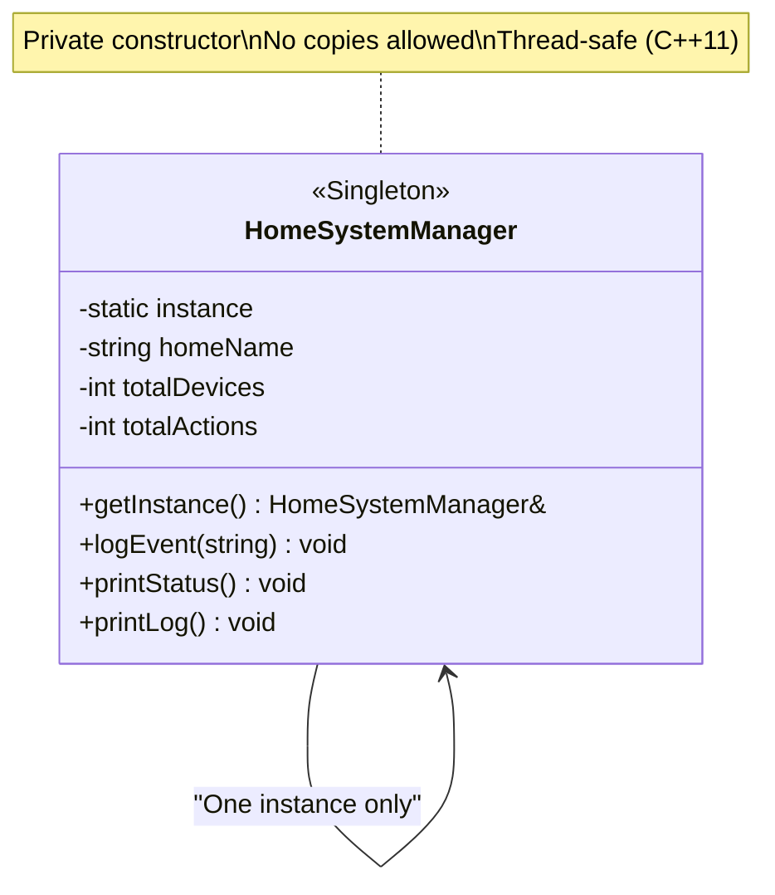
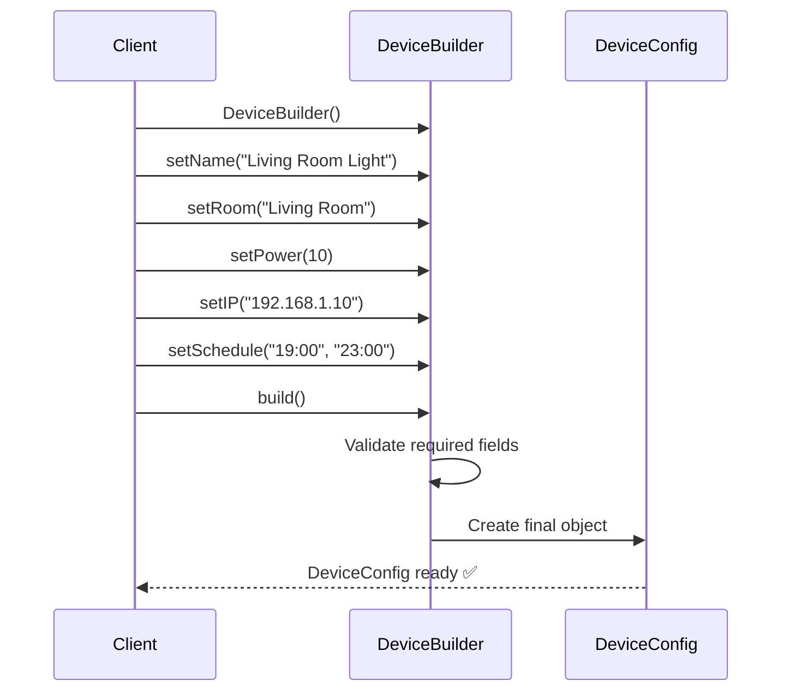
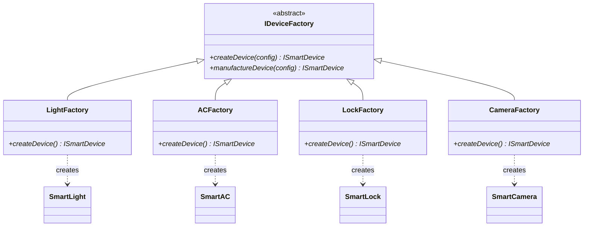
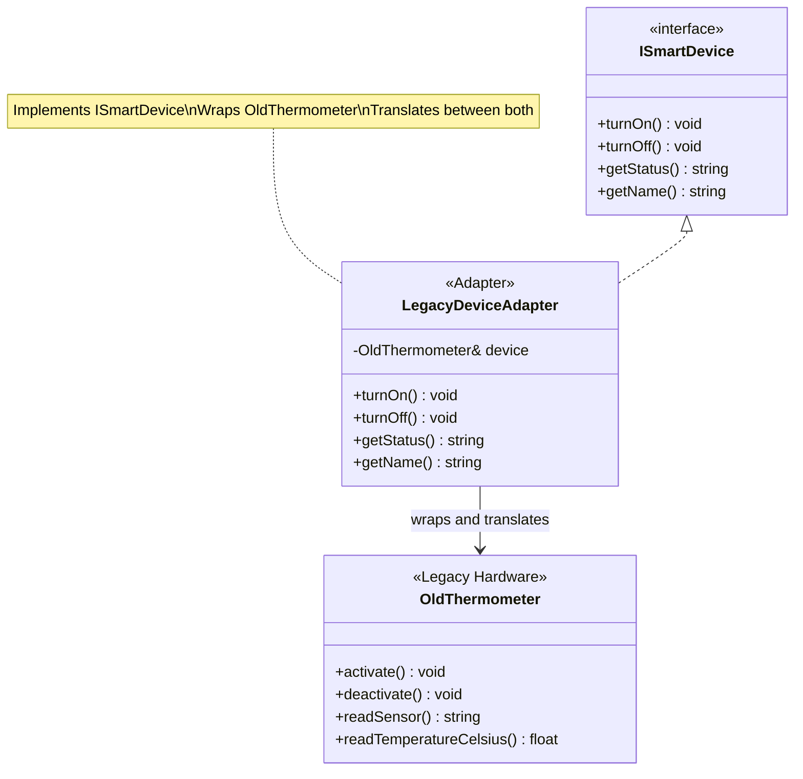
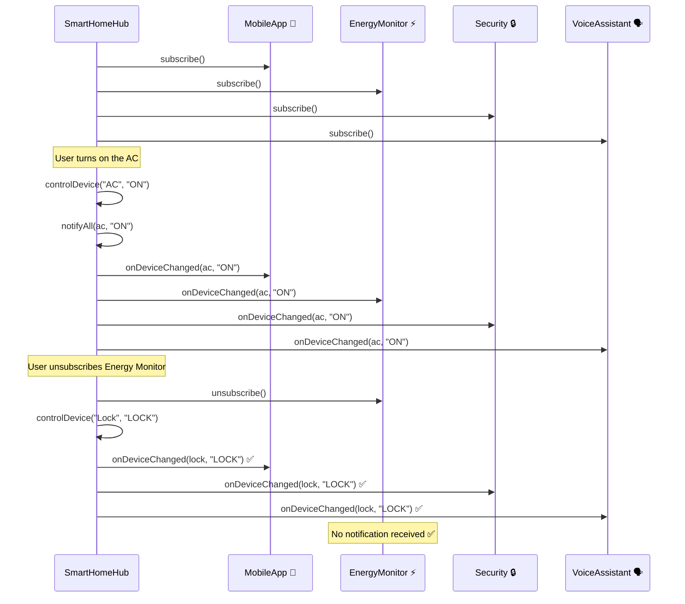

# 🏠 Smart Home System — Design Patterns Project

**A Complete Applied Project Using Five Design Patterns in C++** **Author:** Mohamed Nabil **Standard:** C++17

---

> [!info] Project Overview This project builds a **complete Smart Home System** that applies five design patterns in one realistic, integrated scenario. Each pattern has a clear, well-defined role, and all five patterns work together to form a cohesive, maintainable architecture.

---

## 📋 Table of Contents

1. [[#Project Idea and Patterns Used]]
2. [[#Full Architecture Diagram]]
3. [[#Pattern 1 — Singleton System Manager]]
4. [[#Pattern 2 — Builder Device Configuration]]
5. [[#Pattern 3 — Factory Method Device Creation]]
6. [[#Pattern 4 — Adapter Legacy Device Integration]]
7. [[#Pattern 5 — Observer Notification System]]
8. [[#Full Project Code]]
9. [[#How to Run]]
10. [[#Patterns Summary]]

---

## Project Idea and Patterns Used

### The Scenario

A smart home containing multiple devices (lights, AC, smart lock, camera, fan). The system is managed from a central hub that controls devices, monitors their state, and notifies all interested parties whenever something changes.

### Patterns Map

|Pattern|Class|Problem It Solves|
|---|---|---|
|🔵 **Singleton**|`HomeSystemManager`|One system manager — no data conflicts|
|🟢 **Builder**|`DeviceBuilder`|Build complex device configs step by step|
|🟡 **Factory Method**|`DeviceFactory`|Create different device types without `if/else`|
|🟠 **Adapter**|`LegacyDeviceAdapter`|Integrate incompatible legacy device with new system|
|🔴 **Observer**|`SmartHomeHub`|Notify app, energy monitor, security on every change|

---

## Full Architecture Diagram

```mermaid
classDiagram
    direction TB

    class HomeSystemManager {
        <<Singleton>>
        -static HomeSystemManager* instance
        -string homeName
        -int totalDevices
        -int totalActions
        -vector~string~ eventLog
        +getInstance() HomeSystemManager&
        +logEvent(string) void
        +printStatus() void
        +printLog() void
    }

    class DeviceConfig {
        +string name
        +string room
        +string type
        +string ipAddress
        +int powerWatts
        +bool isOnline
        +bool hasSchedule
        +string scheduleOn
        +string scheduleOff
    }

    class DeviceBuilder {
        <<Builder>>
        -DeviceConfig config
        +setName(string) DeviceBuilder&
        +setRoom(string) DeviceBuilder&
        +setType(string) DeviceBuilder&
        +setIP(string) DeviceBuilder&
        +setPower(int) DeviceBuilder&
        +setOnline(bool) DeviceBuilder&
        +setSchedule(string,string) DeviceBuilder&
        +build() DeviceConfig
    }

    class ISmartDevice {
        <<interface>>
        +turnOn() void*
        +turnOff() void*
        +getStatus() string*
        +getName() string*
        +getRoom() string*
        +getType() string*
        +getPower() int*
    }

    class SmartLight {
        -DeviceConfig config
        -bool isOn
        -int brightness
        -string color
        +turnOn() void
        +turnOff() void
        +setBrightness(int) void
        +setColor(string) void
        +getStatus() string
    }

    class SmartAC {
        -DeviceConfig config
        -bool isOn
        -double temperature
        -string mode
        +turnOn() void
        +turnOff() void
        +setTemperature(double) void
        +setMode(string) void
        +getStatus() string
    }

    class SmartLock {
        -DeviceConfig config
        -bool isLocked
        -string lastUser
        +turnOn() void
        +turnOff() void
        +lock(string) void
        +unlock(string) void
        +getStatus() string
    }

    class SmartCamera {
        -DeviceConfig config
        -bool isOn
        -bool isRecording
        -int motionAlerts
        +turnOn() void
        +turnOff() void
        +startRecording() void
        +detectMotion() void
        +getStatus() string
    }

    class IDeviceFactory {
        <<abstract>>
        +createDevice(DeviceConfig) ISmartDevice*
        +manufactureDevice(DeviceConfig) ISmartDevice*
    }

    class LightFactory { +createDevice(DeviceConfig) ISmartDevice* }
    class ACFactory { +createDevice(DeviceConfig) ISmartDevice* }
    class LockFactory { +createDevice(DeviceConfig) ISmartDevice* }
    class CameraFactory { +createDevice(DeviceConfig) ISmartDevice* }

    class OldThermometer {
        <<Legacy Hardware>>
        +activate() void
        +deactivate() void
        +readSensor() string
        +readTemperatureCelsius() float
    }

    class LegacyDeviceAdapter {
        <<Adapter>>
        -OldThermometer& oldDevice
        +turnOn() void
        +turnOff() void
        +getStatus() string
        +getName() string
        +getRoom() string
    }

    class IDeviceObserver {
        <<interface>>
        +onDeviceChanged(ISmartDevice&, string) void*
        +getObserverName() string*
    }

    class MobileAppObserver { +onDeviceChanged() void }
    class EnergyMonitorObserver { +onDeviceChanged() void }
    class SecurityObserver { +onDeviceChanged() void }
    class VoiceAssistantObserver { +onDeviceChanged() void }

    class SmartHomeHub {
        <<Observer Subject>>
        -vector~ISmartDevice*~ devices
        -vector~IDeviceObserver*~ observers
        +addDevice(ISmartDevice*) void
        +subscribe(IDeviceObserver*) void
        +unsubscribe(IDeviceObserver*) void
        +controlDevice(string, string) void
        +notifyAll(ISmartDevice&, string) void
        +printAllStatus() void
    }

    HomeSystemManager --> HomeSystemManager : Singleton
    DeviceBuilder --> DeviceConfig : builds
    IDeviceFactory <|-- LightFactory
    IDeviceFactory <|-- ACFactory
    IDeviceFactory <|-- LockFactory
    IDeviceFactory <|-- CameraFactory
    ISmartDevice <|.. SmartLight
    ISmartDevice <|.. SmartAC
    ISmartDevice <|.. SmartLock
    ISmartDevice <|.. SmartCamera
    ISmartDevice <|.. LegacyDeviceAdapter
    LegacyDeviceAdapter --> OldThermometer : wraps
    IDeviceFactory --> ISmartDevice : creates
    SmartHomeHub --> ISmartDevice : manages
    SmartHomeHub --> IDeviceObserver : notifies
    IDeviceObserver <|.. MobileAppObserver
    IDeviceObserver <|.. EnergyMonitorObserver
    IDeviceObserver <|.. SecurityObserver
    IDeviceObserver <|.. VoiceAssistantObserver
    SmartHomeHub --> HomeSystemManager : uses
```



---

## Pattern 1 — Singleton: System Manager

> [!note] Why Singleton here? The entire system needs exactly one manager to log events and track statistics. If multiple managers were created, data would conflict and events would be recorded in different places inconsistently.



**How it works in the project:**

- Every device added → registered in the manager
- Every event fired → logged in the manager
- At program end → manager prints the full report

---

## Pattern 2 — Builder: Device Configuration

> [!note] Why Builder here? Every smart device has many settings: name, room, IP, power, schedule, online status... Instead of a constructor with 8 confusing parameters, we build the device configuration step by step with a readable, self-documenting API.



**How it works in the project:**

- Each device is built with a dedicated Builder chain
- Validation happens in `build()` before the object is created
- The same builder can produce differently configured devices

---

## Pattern 3 — Factory Method: Device Creation

> [!note] Why Factory Method here? We have different device types (light, AC, lock, camera). If we wrote `if/else` everywhere to decide which type to instantiate, adding any new device would require modifying existing, tested code. Factory Method solves this elegantly.



**How it works in the project:**

- Each device type has its own dedicated factory
- Adding a new device = new class + new factory only
- Zero modifications to any existing code (OCP)

---

## Pattern 4 — Adapter: Legacy Device Integration

> [!note] Why Adapter here? The home has an old thermometer with a completely different interface from our new system. We cannot modify the old device (it's hardware), so we create an Adapter that makes it work with our system transparently.



**How it works in the project:**

- Old thermometer has `activate()` and `readSensor()`
- Our system expects `turnOn()` and `getStatus()`
- The Adapter translates between the two completely transparently

---

## Pattern 5 — Observer: Notification System

> [!note] Why Observer here? When any device changes (on/off/setting change), multiple parties need to know: the mobile app, the energy monitor, the security system, the voice assistant. Coupling them directly creates tight coupling. Observer solves this with subscribe/notify.



---

## Full Project Code

```cpp
// ============================================================
//  🏠 Smart Home System
// ------------------------------------------------------------
//  Patterns: Singleton, Builder, Factory Method, Adapter, Observer
//  Author:   Mohamed Nabil
//  Standard: C++17
// ============================================================

#include <iostream>
#include <string>
#include <vector>
#include <memory>
#include <map>
#include <algorithm>
#include <mutex>
#include <stdexcept>

// ── Terminal Colors ─────────────────────────────────────────
namespace Color {
    const std::string RESET   = "\033[0m";
    const std::string RED     = "\033[31m";
    const std::string GREEN   = "\033[32m";
    const std::string YELLOW  = "\033[33m";
    const std::string BLUE    = "\033[34m";
    const std::string MAGENTA = "\033[35m";
    const std::string CYAN    = "\033[36m";
    const std::string WHITE   = "\033[37m";
    const std::string BOLD    = "\033[1m";
}

// ── Print Helpers ───────────────────────────────────────────
void printHeader(const std::string& title) {
    std::cout << "\n" << Color::BOLD << Color::CYAN
              << "╔══════════════════════════════════════════════╗\n"
              << "║  " << title;
    int pad = 42 - static_cast<int>(title.size());
    for (int i = 0; i < pad; ++i) std::cout << " ";
    std::cout << "║\n"
              << "╚══════════════════════════════════════════════╝"
              << Color::RESET << "\n";
}

void printSection(const std::string& s) {
    std::cout << Color::BOLD << Color::YELLOW
              << "\n  ── " << s << " ──\n"
              << Color::RESET;
}

void printLine() {
    std::cout << Color::CYAN
              << "  ──────────────────────────────────────────────\n"
              << Color::RESET;
}


// ============================================================
// ║  PATTERN 1: SINGLETON — Home System Manager              ║
// ============================================================
class HomeSystemManager {
public:
    // The one and only access point
    // C++11 magic static: automatically thread-safe
    static HomeSystemManager& getInstance() {
        static HomeSystemManager instance;
        return instance;
    }

    // Prevent all copying
    HomeSystemManager(const HomeSystemManager&)            = delete;
    HomeSystemManager& operator=(const HomeSystemManager&) = delete;

    void setHomeName(const std::string& name) { homeName_ = name; }
    void incrementDevices()  { ++totalDevices_;  }
    void incrementActions()  { ++totalActions_;  }

    void logEvent(const std::string& event) {
        std::lock_guard<std::mutex> lock(mutex_);
        eventLog_.push_back(
            "[" + std::to_string(eventLog_.size() + 1) + "] " + event
        );
    }

    void printStatus() const {
        std::cout << Color::GREEN
                  << "  🏠 Home:          " << homeName_           << "\n"
                  << "  📱 Devices:       " << totalDevices_       << "\n"
                  << "  ⚡ Actions:       " << totalActions_       << "\n"
                  << "  📋 Events logged: " << eventLog_.size()    << "\n"
                  << Color::RESET;
    }

    void printLog() const {
        std::cout << Color::CYAN << "  📋 Event Log:\n" << Color::RESET;
        for (const auto& e : eventLog_)
            std::cout << "    " << e << "\n";
    }

private:
    // Private constructor — no one outside can call new
    HomeSystemManager()
        : homeName_("Unset"), totalDevices_(0), totalActions_(0) {
        std::cout << Color::MAGENTA
                  << "  🔵 [Singleton] HomeSystemManager initialized\n"
                  << Color::RESET;
    }

    std::string              homeName_;
    int                      totalDevices_;
    int                      totalActions_;
    std::vector<std::string> eventLog_;
    mutable std::mutex       mutex_;
};


// ============================================================
// ║  PATTERN 2: BUILDER — Device Configuration               ║
// ============================================================

// Product: the device's configuration object
struct DeviceConfig {
    std::string name;
    std::string room;
    std::string type;
    std::string ipAddress   = "192.168.1.1";
    int         powerWatts  = 0;
    bool        isOnline    = true;
    bool        hasSchedule = false;
    std::string scheduleOn;
    std::string scheduleOff;

    void print() const {
        std::cout << Color::WHITE
                  << "    Name:       " << name       << "\n"
                  << "    Room:       " << room       << "\n"
                  << "    Type:       " << type       << "\n"
                  << "    IP:         " << ipAddress  << "\n"
                  << "    Power:      " << powerWatts << "W\n"
                  << "    Online:     " << (isOnline ? "✅" : "❌") << "\n";
        if (hasSchedule)
            std::cout << "    Schedule:   ON " << scheduleOn
                      << " | OFF " << scheduleOff << "\n";
        std::cout << Color::RESET;
    }
};

// The Builder
class DeviceBuilder {
    DeviceConfig config_;
public:
    // Each method returns *this for method chaining (Fluent Interface)
    DeviceBuilder& setName(const std::string& n) {
        config_.name = n; return *this;
    }
    DeviceBuilder& setRoom(const std::string& r) {
        config_.room = r; return *this;
    }
    DeviceBuilder& setType(const std::string& t) {
        config_.type = t; return *this;
    }
    DeviceBuilder& setIP(const std::string& ip) {
        config_.ipAddress = ip; return *this;
    }
    DeviceBuilder& setPower(int watts) {
        if (watts < 0) throw std::invalid_argument("Power cannot be negative!");
        config_.powerWatts = watts; return *this;
    }
    DeviceBuilder& setOnline(bool online) {
        config_.isOnline = online; return *this;
    }
    DeviceBuilder& setSchedule(const std::string& on, const std::string& off) {
        config_.hasSchedule = true;
        config_.scheduleOn  = on;
        config_.scheduleOff = off;
        return *this;
    }

    // Final step — validate and return the finished product
    DeviceConfig build() {
        if (config_.name.empty())
            throw std::logic_error("Device name is required!");
        if (config_.room.empty())
            throw std::logic_error("Room is required!");
        if (config_.type.empty())
            throw std::logic_error("Device type is required!");

        std::cout << Color::GREEN
                  << "  🟢 [Builder] Config built for: "
                  << config_.name << " ✅\n"
                  << Color::RESET;
        return config_;
    }
};


// ============================================================
// ║  PATTERN 3: FACTORY METHOD — Smart Device Creation       ║
// ============================================================

// ── Smart Device Interface ──────────────────────────────────
class ISmartDevice {
public:
    virtual void        turnOn()          = 0;
    virtual void        turnOff()         = 0;
    virtual std::string getStatus() const = 0;
    virtual std::string getName()   const = 0;
    virtual std::string getRoom()   const = 0;
    virtual std::string getType()   const = 0;
    virtual int         getPower()  const = 0;
    virtual ~ISmartDevice()               = default;

    void printStatus() const {
        std::cout << Color::BLUE
                  << "  📟 [" << getType() << "] "
                  << getName() << " | " << getRoom()
                  << " | " << getStatus() << "\n"
                  << Color::RESET;
    }
};

// ── Concrete Devices ────────────────────────────────────────

// Device 1: Smart Light
class SmartLight : public ISmartDevice {
    DeviceConfig config_;
    bool         isOn_       = false;
    int          brightness_ = 100;
    std::string  color_      = "White";
public:
    explicit SmartLight(DeviceConfig cfg) : config_(std::move(cfg)) {}

    void turnOn() override {
        isOn_ = true;
        HomeSystemManager::getInstance().incrementActions();
        HomeSystemManager::getInstance().logEvent(
            "Light ON: " + config_.name + " [" + config_.room + "]"
        );
        std::cout << Color::YELLOW
                  << "  💡 [SmartLight] " << config_.name
                  << " ON — Brightness: " << brightness_ << "%\n"
                  << Color::RESET;
    }
    void turnOff() override {
        isOn_ = false;
        HomeSystemManager::getInstance().incrementActions();
        HomeSystemManager::getInstance().logEvent(
            "Light OFF: " + config_.name
        );
        std::cout << Color::YELLOW
                  << "  💡 [SmartLight] " << config_.name << " OFF\n"
                  << Color::RESET;
    }
    void setBrightness(int b) {
        brightness_ = std::max(0, std::min(100, b));
        std::cout << Color::YELLOW
                  << "  💡 [SmartLight] " << config_.name
                  << " — Brightness: " << brightness_ << "%\n"
                  << Color::RESET;
    }
    void setColor(const std::string& c) {
        color_ = c;
        std::cout << Color::YELLOW
                  << "  💡 [SmartLight] " << config_.name
                  << " — Color: " << color_ << "\n"
                  << Color::RESET;
    }
    std::string getStatus() const override {
        return (isOn_ ? "✅ ON" : "❌ OFF")
               + std::string(" | Brightness: ") + std::to_string(brightness_) + "%"
               + " | Color: " + color_;
    }
    std::string getName()  const override { return config_.name;       }
    std::string getRoom()  const override { return config_.room;       }
    std::string getType()  const override { return "Smart Light 💡";   }
    int         getPower() const override { return config_.powerWatts; }
};

// Device 2: Smart AC
class SmartAC : public ISmartDevice {
    DeviceConfig config_;
    bool         isOn_        = false;
    double       temperature_ = 24.0;
    std::string  mode_        = "Cool";
public:
    explicit SmartAC(DeviceConfig cfg) : config_(std::move(cfg)) {}

    void turnOn() override {
        isOn_ = true;
        HomeSystemManager::getInstance().incrementActions();
        HomeSystemManager::getInstance().logEvent(
            "AC ON: " + config_.name + " [" + config_.room + "]"
        );
        std::cout << Color::CYAN
                  << "  ❄️  [SmartAC] " << config_.name
                  << " ON — " << temperature_ << "°C | Mode: " << mode_ << "\n"
                  << Color::RESET;
    }
    void turnOff() override {
        isOn_ = false;
        HomeSystemManager::getInstance().incrementActions();
        HomeSystemManager::getInstance().logEvent(
            "AC OFF: " + config_.name
        );
        std::cout << Color::CYAN
                  << "  ❄️  [SmartAC] " << config_.name << " OFF\n"
                  << Color::RESET;
    }
    void setTemperature(double t) {
        temperature_ = std::max(16.0, std::min(30.0, t));
        std::cout << Color::CYAN
                  << "  ❄️  [SmartAC] " << config_.name
                  << " — Temperature: " << temperature_ << "°C\n"
                  << Color::RESET;
    }
    void setMode(const std::string& m) {
        mode_ = m;
        std::cout << Color::CYAN
                  << "  ❄️  [SmartAC] " << config_.name
                  << " — Mode: " << mode_ << "\n"
                  << Color::RESET;
    }
    std::string getStatus() const override {
        return (isOn_ ? "✅ ON" : "❌ OFF")
               + std::string(" | ") + std::to_string(temperature_) + "°C"
               + " | " + mode_;
    }
    std::string getName()  const override { return config_.name;       }
    std::string getRoom()  const override { return config_.room;       }
    std::string getType()  const override { return "Smart AC ❄️";      }
    int         getPower() const override { return config_.powerWatts; }
};

// Device 3: Smart Lock
class SmartLock : public ISmartDevice {
    DeviceConfig config_;
    bool         isOn_      = true;
    bool         isLocked_  = true;
    std::string  lastUser_;
public:
    explicit SmartLock(DeviceConfig cfg) : config_(std::move(cfg)) {}

    void turnOn()  override {
        isOn_ = true;
        std::cout << Color::GREEN
                  << "  🔒 [SmartLock] " << config_.name << " Active\n"
                  << Color::RESET;
    }
    void turnOff() override {
        isOn_ = false;
        std::cout << Color::RED
                  << "  🔒 [SmartLock] " << config_.name << " Inactive ⚠️\n"
                  << Color::RESET;
    }
    void lock(const std::string& user = "System") {
        isLocked_ = true;
        lastUser_ = user;
        HomeSystemManager::getInstance().incrementActions();
        HomeSystemManager::getInstance().logEvent(
            "Door LOCKED: " + config_.name + " by " + user
        );
        std::cout << Color::GREEN
                  << "  🔒 [SmartLock] " << config_.name
                  << " — Locked by: " << user << "\n"
                  << Color::RESET;
    }
    void unlock(const std::string& user = "System") {
        isLocked_ = false;
        lastUser_ = user;
        HomeSystemManager::getInstance().incrementActions();
        HomeSystemManager::getInstance().logEvent(
            "Door UNLOCKED: " + config_.name + " by " + user
        );
        std::cout << Color::YELLOW
                  << "  🔓 [SmartLock] " << config_.name
                  << " — Unlocked by: " << user << "\n"
                  << Color::RESET;
    }
    std::string getStatus() const override {
        return std::string(isLocked_ ? "🔒 Locked" : "🔓 Unlocked")
               + (lastUser_.empty() ? "" : " | Last user: " + lastUser_);
    }
    std::string getName()  const override { return config_.name;       }
    std::string getRoom()  const override { return config_.room;       }
    std::string getType()  const override { return "Smart Lock 🔒";    }
    int         getPower() const override { return config_.powerWatts; }
    bool        isLocked() const          { return isLocked_;          }
};

// Device 4: Smart Camera
class SmartCamera : public ISmartDevice {
    DeviceConfig config_;
    bool         isOn_         = false;
    bool         isRecording_  = false;
    int          motionAlerts_ = 0;
public:
    explicit SmartCamera(DeviceConfig cfg) : config_(std::move(cfg)) {}

    void turnOn() override {
        isOn_ = true;
        HomeSystemManager::getInstance().incrementActions();
        HomeSystemManager::getInstance().logEvent(
            "Camera ON: " + config_.name + " [" + config_.room + "]"
        );
        std::cout << Color::MAGENTA
                  << "  📷 [SmartCamera] " << config_.name << " ON\n"
                  << Color::RESET;
    }
    void turnOff() override {
        isOn_ = false; isRecording_ = false;
        HomeSystemManager::getInstance().incrementActions();
        HomeSystemManager::getInstance().logEvent(
            "Camera OFF: " + config_.name
        );
        std::cout << Color::MAGENTA
                  << "  📷 [SmartCamera] " << config_.name << " OFF\n"
                  << Color::RESET;
    }
    void startRecording() {
        if (!isOn_) turnOn();
        isRecording_ = true;
        std::cout << Color::RED
                  << "  🔴 [SmartCamera] " << config_.name << " — RECORDING!\n"
                  << Color::RESET;
    }
    void detectMotion() {
        ++motionAlerts_;
        HomeSystemManager::getInstance().logEvent(
            "Motion alert: " + config_.name
            + " (#" + std::to_string(motionAlerts_) + ")"
        );
        std::cout << Color::RED
                  << "  🚨 [SmartCamera] " << config_.name
                  << " — Motion detected! (Alert #" << motionAlerts_ << ")\n"
                  << Color::RESET;
    }
    std::string getStatus() const override {
        return (isOn_ ? "✅ ON" : "❌ OFF")
               + std::string(isRecording_ ? " | 🔴 REC" : "")
               + " | Alerts: " + std::to_string(motionAlerts_);
    }
    std::string getName()  const override { return config_.name;       }
    std::string getRoom()  const override { return config_.room;       }
    std::string getType()  const override { return "Smart Camera 📷";  }
    int         getPower() const override { return config_.powerWatts; }
};

// ── Abstract Factory ────────────────────────────────────────
class IDeviceFactory {
public:
    // Factory Method — subclasses decide what to create
    virtual std::unique_ptr<ISmartDevice> createDevice(DeviceConfig cfg) = 0;
    virtual ~IDeviceFactory() = default;

    // Template method — uses factory method, adds logging
    std::unique_ptr<ISmartDevice> manufactureDevice(DeviceConfig cfg) {
        auto device = createDevice(std::move(cfg));
        HomeSystemManager::getInstance().incrementDevices();
        HomeSystemManager::getInstance().logEvent(
            "Device installed: " + device->getName()
            + " [" + device->getRoom() + "] — " + device->getType()
        );
        std::cout << Color::GREEN
                  << "  🟡 [Factory] Manufactured: " << device->getName()
                  << " (" << device->getType() << ")\n"
                  << Color::RESET;
        return device;
    }
};

// ── Concrete Factories ──────────────────────────────────────
class LightFactory : public IDeviceFactory {
public:
    std::unique_ptr<ISmartDevice> createDevice(DeviceConfig cfg) override {
        cfg.type = "Smart Light 💡";
        return std::make_unique<SmartLight>(std::move(cfg));
    }
};

class ACFactory : public IDeviceFactory {
public:
    std::unique_ptr<ISmartDevice> createDevice(DeviceConfig cfg) override {
        cfg.type = "Smart AC ❄️";
        return std::make_unique<SmartAC>(std::move(cfg));
    }
};

class LockFactory : public IDeviceFactory {
public:
    std::unique_ptr<ISmartDevice> createDevice(DeviceConfig cfg) override {
        cfg.type = "Smart Lock 🔒";
        return std::make_unique<SmartLock>(std::move(cfg));
    }
};

class CameraFactory : public IDeviceFactory {
public:
    std::unique_ptr<ISmartDevice> createDevice(DeviceConfig cfg) override {
        cfg.type = "Smart Camera 📷";
        return std::make_unique<SmartCamera>(std::move(cfg));
    }
};


// ============================================================
// ║  PATTERN 4: ADAPTER — Legacy Device Integration          ║
// ============================================================

// The old device — cannot be modified (legacy hardware)
class OldThermometer {
    bool  isActive_ = false;
    float tempC_    = 22.5f;
public:
    // Old incompatible interface
    void activate() {
        isActive_ = true;
        std::cout << Color::YELLOW
                  << "  [Legacy] OldThermometer: ACTIVATE\n"
                  << Color::RESET;
    }
    void deactivate() {
        isActive_ = false;
        std::cout << Color::YELLOW
                  << "  [Legacy] OldThermometer: DEACTIVATE\n"
                  << Color::RESET;
    }
    std::string readSensor() {
        return "TEMP_RAW:" + std::to_string(tempC_) + "C;HUMIDITY:60%";
    }
    float readTemperatureCelsius() const { return tempC_; }
    bool  isActive()               const { return isActive_; }
    void  simulateReading(float t)       { tempC_ = t; }
};

// The Adapter — implements ISmartDevice, wraps OldThermometer
class LegacyDeviceAdapter : public ISmartDevice {
    OldThermometer& oldDevice_;
    std::string     name_;
    std::string     room_;
public:
    LegacyDeviceAdapter(OldThermometer& dev,
                         const std::string& name,
                         const std::string& room)
        : oldDevice_(dev), name_(name), room_(room) {}

    // Translate turnOn() → activate()
    void turnOn() override {
        std::cout << Color::YELLOW
                  << "  🟠 [Adapter] Translating turnOn() → activate()\n"
                  << Color::RESET;
        oldDevice_.activate();
        HomeSystemManager::getInstance().incrementActions();
        HomeSystemManager::getInstance().logEvent("Activated (via Adapter): " + name_);
    }

    // Translate turnOff() → deactivate()
    void turnOff() override {
        std::cout << Color::YELLOW
                  << "  🟠 [Adapter] Translating turnOff() → deactivate()\n"
                  << Color::RESET;
        oldDevice_.deactivate();
    }

    // Translate getStatus() → readSensor() + convert output
    std::string getStatus() const override {
        float temp = oldDevice_.readTemperatureCelsius();
        return (oldDevice_.isActive() ? "✅ Active" : "❌ Inactive")
               + std::string(" | Temp: ")
               + std::to_string(temp).substr(0, 4) + "°C";
    }

    std::string getName()  const override { return name_; }
    std::string getRoom()  const override { return room_; }
    std::string getType()  const override { return "Thermometer 🌡️ (Adapted)"; }
    int         getPower() const override { return 2; }
};


// ============================================================
// ║  PATTERN 5: OBSERVER — Smart Home Notification System    ║
// ============================================================

// ── Observer Interface ──────────────────────────────────────
class IDeviceObserver {
public:
    virtual void onDeviceChanged(const ISmartDevice& device,
                                  const std::string& event) = 0;
    virtual std::string getObserverName() const             = 0;
    virtual ~IDeviceObserver()                              = default;
};

// ── Concrete Observers ──────────────────────────────────────

// Observer 1: Mobile App
class MobileAppObserver : public IDeviceObserver {
    std::string ownerName_;
public:
    explicit MobileAppObserver(const std::string& owner) : ownerName_(owner) {}
    std::string getObserverName() const override {
        return "📱 " + ownerName_ + "'s App";
    }
    void onDeviceChanged(const ISmartDevice& dev,
                          const std::string& event) override {
        std::cout << Color::BLUE
                  << "  📱 [" << ownerName_ << "'s App] Notification: "
                  << dev.getName() << " — " << event << "\n"
                  << Color::RESET;
    }
};

// Observer 2: Energy Monitor
class EnergyMonitorObserver : public IDeviceObserver {
    int totalPower_    = 0;
    int activeDevices_ = 0;
public:
    std::string getObserverName() const override { return "⚡ Energy Monitor"; }
    void onDeviceChanged(const ISmartDevice& dev,
                          const std::string& event) override {
        if (event.find("ON") != std::string::npos) {
            totalPower_    += dev.getPower();
            ++activeDevices_;
        } else if (event.find("OFF") != std::string::npos) {
            totalPower_    -= dev.getPower();
            if (activeDevices_ > 0) --activeDevices_;
        }
        std::cout << Color::YELLOW
                  << "  ⚡ [Energy] Total: " << totalPower_
                  << "W | Active devices: " << activeDevices_ << "\n"
                  << Color::RESET;
    }
    int getTotalPower()    const { return totalPower_;    }
    int getActiveDevices() const { return activeDevices_; }
};

// Observer 3: Security System
class SecurityObserver : public IDeviceObserver {
    std::vector<std::string> securityLog_;
public:
    std::string getObserverName() const override { return "🔐 Security System"; }
    void onDeviceChanged(const ISmartDevice& dev,
                          const std::string& event) override {
        // Security only cares about locks and cameras
        if (dev.getType().find("Lock")   != std::string::npos ||
            dev.getType().find("Camera") != std::string::npos) {
            std::string entry = dev.getName() + ": " + event;
            securityLog_.push_back(entry);
            std::cout << Color::RED
                      << "  🔐 [Security] Security event logged: " << entry << "\n"
                      << Color::RESET;
        }
    }
    void printSecurityLog() const {
        std::cout << Color::RED << "  🔐 Security Log:\n" << Color::RESET;
        for (const auto& e : securityLog_)
            std::cout << "    • " << e << "\n";
    }
};

// Observer 4: Voice Assistant
class VoiceAssistantObserver : public IDeviceObserver {
public:
    std::string getObserverName() const override { return "🗣️ Voice Assistant"; }
    void onDeviceChanged(const ISmartDevice& dev,
                          const std::string& event) override {
        std::cout << Color::MAGENTA
                  << "  🗣️  [Assistant]: " << dev.getName()
                  << " in " << dev.getRoom() << " is now " << event << "\n"
                  << Color::RESET;
    }
};

// ── Smart Home Hub (Subject) ────────────────────────────────
class SmartHomeHub {
    std::vector<std::shared_ptr<ISmartDevice>> devices_;
    std::vector<IDeviceObserver*>              observers_;
public:
    void addDevice(std::shared_ptr<ISmartDevice> device) {
        devices_.push_back(std::move(device));
    }

    void subscribe(IDeviceObserver* obs) {
        observers_.push_back(obs);
        std::cout << Color::GREEN
                  << "  ✅ [Hub] " << obs->getObserverName()
                  << " subscribed to notifications\n"
                  << Color::RESET;
    }

    void unsubscribe(IDeviceObserver* obs) {
        observers_.erase(
            std::remove(observers_.begin(), observers_.end(), obs),
            observers_.end()
        );
        std::cout << Color::YELLOW
                  << "  ⚠️  [Hub] " << obs->getObserverName()
                  << " unsubscribed\n"
                  << Color::RESET;
    }

    void notifyAll(const ISmartDevice& device, const std::string& event) {
        for (auto* obs : observers_)
            obs->onDeviceChanged(device, event);
    }

    void controlDevice(const std::string& deviceName,
                        const std::string& action) {
        for (auto& device : devices_) {
            if (device->getName() == deviceName) {
                std::cout << Color::BOLD << Color::WHITE
                          << "\n  🎛️  [Hub] Control: "
                          << deviceName << " → " << action << "\n"
                          << Color::RESET;
                if (action == "ON") {
                    device->turnOn();
                    notifyAll(*device, "ON");
                } else if (action == "OFF") {
                    device->turnOff();
                    notifyAll(*device, "OFF");
                }
                return;
            }
        }
        std::cout << Color::RED
                  << "  ❌ [Hub] Device not found: " << deviceName << "\n"
                  << Color::RESET;
    }

    void printAllStatus() const {
        std::cout << Color::BOLD << Color::CYAN
                  << "\n  📊 All Devices Status:\n"
                  << Color::RESET;
        printLine();
        for (const auto& d : devices_)
            d->printStatus();
        printLine();
    }

    int getDeviceCount()   const { return static_cast<int>(devices_.size());   }
    int getObserverCount() const { return static_cast<int>(observers_.size()); }
};


// ============================================================
// ║  MAIN — All Patterns Together in Realistic Scenarios     ║
// ============================================================
int main() {

    std::cout << Color::BOLD << Color::CYAN
              << "\n╔═════════════════════════════════════════════════╗\n"
              << "║       🏠 Smart Home System                      ║\n"
              << "║       Five Design Patterns in Action            ║\n"
              << "╚═════════════════════════════════════════════════╝\n"
              << Color::RESET;

    // ══════════════════════════════════════════════════════
    // PATTERN 1: SINGLETON
    // ══════════════════════════════════════════════════════
    printHeader("1. SINGLETON — System Manager");

    HomeSystemManager& mgr1 = HomeSystemManager::getInstance();
    HomeSystemManager& mgr2 = HomeSystemManager::getInstance();
    mgr1.setHomeName("Palm Villa Smart Home");

    std::cout << Color::GREEN
              << "  Same instance? "
              << (&mgr1 == &mgr2 ? "✅ YES — Single instance" : "❌ NO") << "\n"
              << Color::RESET;


    // ══════════════════════════════════════════════════════
    // PATTERN 2: BUILDER
    // ══════════════════════════════════════════════════════
    printHeader("2. BUILDER — Device Configurations");

    printSection("Building: Living Room Light config");
    DeviceConfig lightCfg = DeviceBuilder()
        .setName("Living Room Light")
        .setRoom("Living Room")
        .setType("Light")
        .setIP("192.168.1.10")
        .setPower(10)
        .setSchedule("19:00", "23:00")
        .build();
    lightCfg.print();

    printSection("Building: Bedroom AC config");
    DeviceConfig acCfg = DeviceBuilder()
        .setName("Bedroom AC")
        .setRoom("Master Bedroom")
        .setType("AC")
        .setIP("192.168.1.20")
        .setPower(1500)
        .setSchedule("22:00", "07:00")
        .build();
    acCfg.print();

    printSection("Building: Front Door Lock config");
    DeviceConfig lockCfg = DeviceBuilder()
        .setName("Front Door Lock")
        .setRoom("Entrance")
        .setType("Lock")
        .setIP("192.168.1.30")
        .setPower(5)
        .build();
    lockCfg.print();

    printSection("Building: Garden Camera config");
    DeviceConfig camCfg = DeviceBuilder()
        .setName("Garden Camera")
        .setRoom("Garden")
        .setType("Camera")
        .setIP("192.168.1.40")
        .setPower(8)
        .build();
    camCfg.print();


    // ══════════════════════════════════════════════════════
    // PATTERN 3: FACTORY METHOD
    // ══════════════════════════════════════════════════════
    printHeader("3. FACTORY METHOD — Manufacturing Devices");

    LightFactory  lightFactory;
    ACFactory     acFactory;
    LockFactory   lockFactory;
    CameraFactory cameraFactory;

    auto smartLight  = lightFactory.manufactureDevice(lightCfg);
    auto smartAC     = acFactory.manufactureDevice(acCfg);
    auto smartLock   = lockFactory.manufactureDevice(lockCfg);
    auto smartCamera = cameraFactory.manufactureDevice(camCfg);

    // Get typed pointers for specialized operations
    auto* lightPtr  = dynamic_cast<SmartLight*>(smartLight.get());
    auto* acPtr     = dynamic_cast<SmartAC*>(smartAC.get());
    auto* lockPtr   = dynamic_cast<SmartLock*>(smartLock.get());
    auto* cameraPtr = dynamic_cast<SmartCamera*>(smartCamera.get());


    // ══════════════════════════════════════════════════════
    // PATTERN 4: ADAPTER
    // ══════════════════════════════════════════════════════
    printHeader("4. ADAPTER — Legacy Device Integration");

    OldThermometer      oldThermo;
    LegacyDeviceAdapter thermoAdapter(oldThermo, "Kitchen Thermometer", "Kitchen");

    std::cout << Color::YELLOW
              << "  Legacy device interface:\n"
              << "    activate() / deactivate() / readSensor()\n"
              << "  New system expects:\n"
              << "    turnOn() / turnOff() / getStatus()\n"
              << "  Adapter translates transparently:\n"
              << Color::RESET;

    thermoAdapter.turnOn();
    oldThermo.simulateReading(26.3f);
    std::cout << "  Thermometer status: " << thermoAdapter.getStatus() << "\n";
    thermoAdapter.turnOff();


    // ══════════════════════════════════════════════════════
    // PATTERN 5: OBSERVER
    // ══════════════════════════════════════════════════════
    printHeader("5. OBSERVER — Control Hub & Notifications");

    SmartHomeHub hub;

    // Register all devices with the hub
    printSection("Registering devices with the hub");
    hub.addDevice(std::move(smartLight));
    hub.addDevice(std::move(smartAC));
    hub.addDevice(std::move(smartLock));
    hub.addDevice(std::move(smartCamera));
    hub.addDevice(std::make_shared<LegacyDeviceAdapter>(
        oldThermo, "Kitchen Thermometer", "Kitchen"
    ));

    // Create observers
    MobileAppObserver     ownerApp("John");
    MobileAppObserver     guestApp("Sarah");
    EnergyMonitorObserver energyMonitor;
    SecurityObserver      securitySystem;
    VoiceAssistantObserver voiceAssistant;

    // Subscribe
    printSection("Subscribing to notifications");
    hub.subscribe(&ownerApp);
    hub.subscribe(&guestApp);
    hub.subscribe(&energyMonitor);
    hub.subscribe(&securitySystem);
    hub.subscribe(&voiceAssistant);


    // ── Scenario 1: Morning — Wake up routine ─────────────
    printSection("Scenario 1: Morning — Wake Up Routine");

    hub.controlDevice("Living Room Light", "ON");
    hub.controlDevice("Bedroom AC",        "ON");
    hub.controlDevice("Garden Camera",     "ON");

    // Specialized operations
    if (lightPtr)  lightPtr->setBrightness(70);
    if (lightPtr)  lightPtr->setColor("Warm White");
    if (acPtr)     acPtr->setTemperature(22.0);
    if (acPtr)     acPtr->setMode("Cool");
    if (cameraPtr) cameraPtr->startRecording();


    // ── Scenario 2: Visitor arrives ───────────────────────
    printSection("Scenario 2: Visitor Arrives");

    if (lockPtr) {
        lockPtr->unlock("John");
        hub.notifyAll(*lockPtr, "Door Unlocked");
    }
    // After visitor enters
    if (lockPtr) {
        lockPtr->lock("Auto System");
        hub.notifyAll(*lockPtr, "Door Locked");
    }


    // ── Scenario 3: Motion detected ───────────────────────
    printSection("Scenario 3: Motion Detected");

    if (cameraPtr) {
        cameraPtr->detectMotion();
        hub.notifyAll(*cameraPtr, "Suspicious motion detected!");
    }


    // ── Scenario 4: Guest app unsubscribes ────────────────
    printSection("Scenario 4: Sarah Unsubscribes");
    hub.unsubscribe(&guestApp);

    std::cout << "  [Notifications now going to "
              << hub.getObserverCount() << " parties]\n";

    hub.controlDevice("Living Room Light", "OFF");


    // ── Scenario 5: Night — Shut down routine ─────────────
    printSection("Scenario 5: Night — Shut Down Routine");
    hub.controlDevice("Bedroom AC",    "OFF");
    hub.controlDevice("Garden Camera", "OFF");


    // ══════════════════════════════════════════════════════
    // FINAL SUMMARY
    // ══════════════════════════════════════════════════════
    printHeader("Final Summary");

    hub.printAllStatus();

    printSection("System Statistics");
    HomeSystemManager::getInstance().printStatus();

    printSection("Energy Report");
    std::cout << Color::YELLOW
              << "  Current consumption: " << energyMonitor.getTotalPower()
              << "W\n"
              << "  Active devices:      " << energyMonitor.getActiveDevices()
              << "\n"
              << Color::RESET;

    printSection("Security Log");
    securitySystem.printSecurityLog();

    printSection("Full System Event Log");
    HomeSystemManager::getInstance().printLog();

    // ── Patterns summary box ──────────────────────────────
    std::cout << "\n" << Color::BOLD << Color::CYAN
              << "╔══════════════════════════════════════════════════╗\n"
              << "║          Design Patterns Used in This Project   ║\n"
              << "╠══════════════════════════════════════════════════╣\n"
              << "║  🔵 Singleton  → HomeSystemManager              ║\n"
              << "║     One manager tracks the entire system        ║\n"
              << "╠══════════════════════════════════════════════════╣\n"
              << "║  🟢 Builder    → DeviceBuilder                  ║\n"
              << "║     Build device configs step by step           ║\n"
              << "╠══════════════════════════════════════════════════╣\n"
              << "║  🟡 Factory    → LightFactory / ACFactory ...   ║\n"
              << "║     Create devices without if/else chains       ║\n"
              << "╠══════════════════════════════════════════════════╣\n"
              << "║  🟠 Adapter    → LegacyDeviceAdapter            ║\n"
              << "║     Integrate old thermometer transparently     ║\n"
              << "╠══════════════════════════════════════════════════╣\n"
              << "║  🔴 Observer   → SmartHomeHub                   ║\n"
              << "║     Notify app, energy, security automatically  ║\n"
              << "╚══════════════════════════════════════════════════╝\n"
              << Color::RESET;

    return 0;
}

// ============================================================
//  Build & Run:
//    g++ -std=c++17 -o smart_home smart_home.cpp && ./smart_home
// ============================================================
```

---

## How to Run

```bash
# Compile
g++ -std=c++17 -o smart_home smart_home.cpp

# Run
./smart_home
```

> [!tip] Requirements
> 
> - Compiler supporting C++17 (GCC 7+, Clang 5+, MSVC 2017+)
> - Linux/macOS for colored terminal output
> - On Windows: use Windows Terminal or VSCode integrated terminal

---

## Patterns Summary

```mermaid
mindmap
  root((🏠 Smart Home))
    🔵 Singleton
      HomeSystemManager
      One instance only
      Thread-safe
      Logs all events
    🟢 Builder
      DeviceBuilder
      Fluent Interface
      Step-by-step construction
      Validates in build()
    🟡 Factory Method
      LightFactory
      ACFactory
      LockFactory
      CameraFactory
    🟠 Adapter
      LegacyDeviceAdapter
      Wraps OldThermometer
      Translates interface
      OCP respected
    🔴 Observer
      SmartHomeHub
      MobileAppObserver
      EnergyMonitorObserver
      SecurityObserver
      VoiceAssistantObserver
```

### How the Patterns Interact

|Pattern|Interacts With|How|
|---|---|---|
|**Singleton**|Everyone|Every pattern logs its events through the manager|
|**Builder**|Factory Method|Produces `DeviceConfig` consumed by the factory|
|**Factory Method**|Builder + Observer|Takes Config from Builder, produces devices for the Hub|
|**Adapter**|Factory Method + Observer|Treated as a first-class device throughout the system|
|**Observer**|Everyone|Notifies all subscribers on every device state change|

### Patterns and SOLID

|Pattern|SOLID Principle Applied|
|---|---|
|Singleton|SRP — one responsibility: manage single instance|
|Builder|SRP — separate construction from representation|
|Factory Method|OCP — add new devices without changing creator code|
|Adapter|OCP + DIP — depend on interface, adapt the detail|
|Observer|OCP + DIP — add observers without changing the Subject|

---

> [!success] Key Takeaways
> 
> 1. **Singleton** — guarantees one instance of the manager for the entire program lifetime
> 2. **Builder** — builds complex objects safely and readably using method chaining
> 3. **Factory Method** — creates different device types without modifying existing code (OCP)
> 4. **Adapter** — integrates legacy hardware with the new system without touching either side
> 5. **Observer** — notifies multiple independent parties automatically on every state change

---

_Author: Mohamed Nabil | Applied Project — Design Patterns in C++_